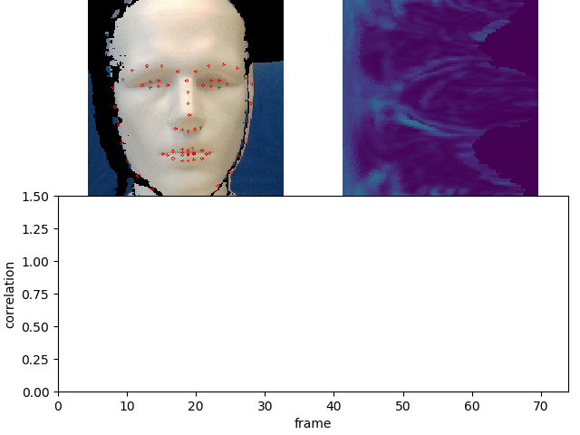
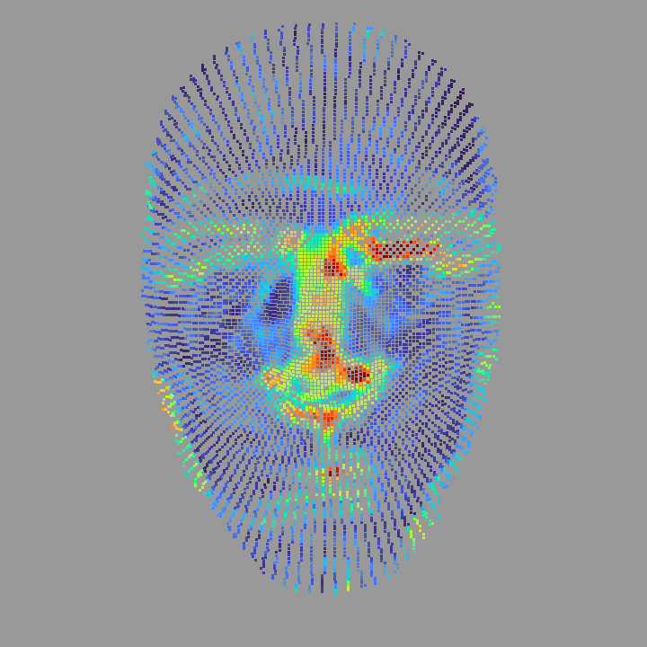

# 4D Curvature Analysis of Radial Stripes for Facial Behavior Research
This repository contains the official source code used to produce the results reported in the following papers:

> [**Facial Behavior Analysis using 4D Curvature Statistics for Presentation Attack Detection**][1]  
> Martin Thümmel, Sven Sickert and Joachim Denzler.
> IEEE International Workshop on Biometrics and Forensics, 2021.

If you use this code, please cite this paper.

<strong>Table of Contents</strong>

1. [Installation](#1-installation)
2. [3D-Sensor Prequesites](#2-3d-sensor-prequesites)
3. [Results](#3-results)

## 1. Installation
The following commands install all requirements for Ubuntu.
This code was tested with Ubuntu v18.04., dlib v19.13, PCL v1.9.1, libigl v2.1.0, Eigen v3.3.0, lz4 v1.8.2, librealsense v2.30.0 and OpenCV v4.0.0.
To use the RealSense camera, you need to install

    apt install libusb-1.0-0-dev

For visualizing the point cloud, you need to install

    apt install libgl1-mesa-glx libgtk-3-dev libglfw3-dev libglu1-mesa-dev

and FLANN and OpenGL for PCL

    apt install freeglut3-dev mesa-common-dev libflann-dev

For visualizing the temporal cross-correlation using matplotlib in C++, you need to install

    apt install python-2.7 matplotlib-dev

and download matplotlibcpp.h from [here](https://github.com/lava/matplotlib-cpp) to the source folder.
For face and landmark localization you need to download OpenCV from [here](https://github.com/opencv/opencv), Eigen from [here](http://eigen.tuxfamily.org/index.php?title=Main_Page), Librealsense from [here](https://github.com/IntelRealSense/librealsense), PCL from [here](https://github.com/PointCloudLibrary/pcl), and Dlib from [here](https://github.com/davisking/dlib).
All of these libraries need to be installed locally e.g. in `$HOME/libs`. For installing PCL, you have to set `WITH_VTK=FALSE`.

For installing libigl, first clone the following repository to your library folder

    git clone --single-branch --branch martinsChanges gogs@triton.inf-cv.uni-jena.de:3DFaces/libigl_Martin.git

Then create a build folder inside and call cmake from this build folder as follows

    cmake -D LIBIGL_USE_STATIC_LIBRARY=OFF -D LIBIGL_BUILD_TESTS=OFF -D LIBIGL_BUILD_TUTORIAL=OFF ..

To let cmake automatically find the libraries above, respective paths (`PCL_DIR`, `OpenCV_DIR`, `Eigen3_DIR`, `dlib_DIR`, `LIBIGL`, `realsense2_DIR`) need to be set properly.

As a pretrained model you need to download the dlib landmark model `shape_predictor_68_face_landmarks.dat` from [here](https://github.com/davisking/dlib-models) and set the path to this model in the source code accordingly.

Finally, python (tested: 3.7.3) with matplotlib (tested: 3.1.1) have to be installed for visualization purposes.
The path to this python library and include directory must be set in the CMakeLists.txt file accordingly. For some reason, matplotlib is not working in C++ using python 3.6.

## 2. 3D-Sensor Prerequisites
To run an offline analysis by passing a BAG-file as an argument you need to call the program as follows:

        ./radialStripe4DCurvature [inputBagFilePath]
        
where `inputBagFilePath` is the path to the BAG-file.

Instead of the more expensive RealSense D435 you can also run the D415 version. 
It has a smaller field of view and a higher relative resolution for face scans at the same distance.
The minimum object distance could be lower than 45 cm in case of the D435, but that is unsuited in case of face scans. 
The more expensive global shutter of the D435 is not required since the movement of the face and facial expressions are slow. 
The *faceConfig.json* file in the repository adjusts all recommended parameters for near-range face capturing.
The object distance to the nose tip should not be much larger than the minimum distance of 45 cm to obtain the highes accuracy.
The environment must be bright and nothing should occlude the face for optimal results (like glasses, large beards, scarfs or hats).

## 3. PAD Results
<table>
    <thead>
        <tr>
            <th>Curvature correlation time series (low for masks, high for genuine faces)</th>
            <th>Visualization of extracted radial stripes </th>
        </tr>
    </thead>
    <tbody>
        <tr>
            <td></td>
            <td></td>
        </tr>
    </tbody>
    <tbody>
        <tr>
            <td></td>
            <td></td>
        </tr>
    </tbody>
    <tbody>
        <tr>
            <td></td>
            <td></td>
        </tr>
    </tbody>
    <tbody>
        <tr>
            <td></td>
            <td></td>
        </tr>
    </tbody>
    <tbody>
        <tr>
            <td></td>
            <td></td>
        </tr>
    </tbody>                
</table>

[1]: Pre-print available at https://arxiv.org/abs/1910.06056
